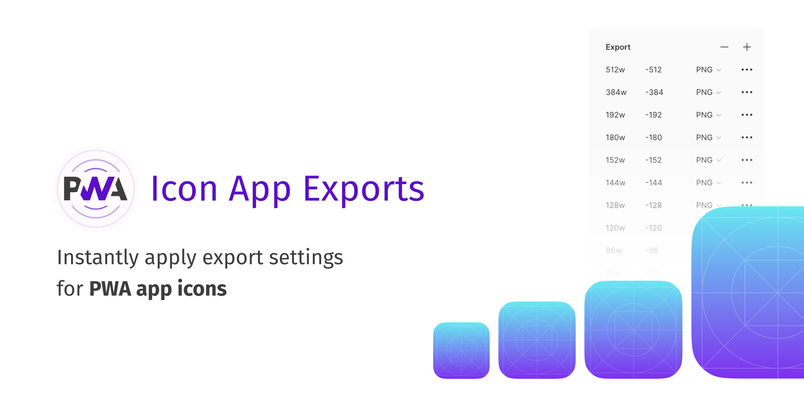

# PWA Icon App Exports 📱

Apply to the selected frame the required export settings for PWA icons App.

[Install on Figma](https://www.figma.com/c/plugin/771341909571444129/PWA-Icon-App-Exports)

## Usage

1. Select a frame containing your app icon.
2. Press `command + /` and search for 'PWA Icon App Exports'
3. Run the plugin
4. `command + shift + p` to re-run the plugin instantly

## Installing on Figma

Search for the eponym plugin on Figma / Plugins menu.
Or visit the [Official Figma Plugin Page](https://www.figma.com/c/plugin/771341909571444129/PWA-Icon-App-Exports).

## Installation and contributing

If you want to participate to the development, you will need to install the plugin locally and set a development environment within Figma.

1. Go to a folder of your choice to put the plugin on it.
1. Clone the repository: `git clone https://github.com/geoffreycrofte/figma-pwa-icon-app-exports.git`
1. Go to the directory: `cd figma-pwa-icon-app-exports`
1. Install FigPlug: `npm i -g figplug`
1. Build the plugin: `figplug build -w -o=build`
1. Add a new development plugin to Figma
1. Select the `figma-pwa-icon-app-exports/build/manifest.json` file as the manifest

## Contact

Ping me on [Twitter](https://twitter.com/geoffreycrofte) if you want to talk about this.

## Thanks

Code forked from [Briand Lovin iOS Plugin](https://github.com/brianlovin/figma-ios-export-settings), thanks for that ☺️